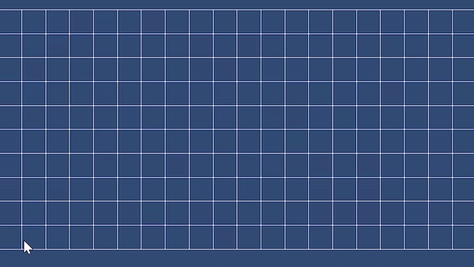
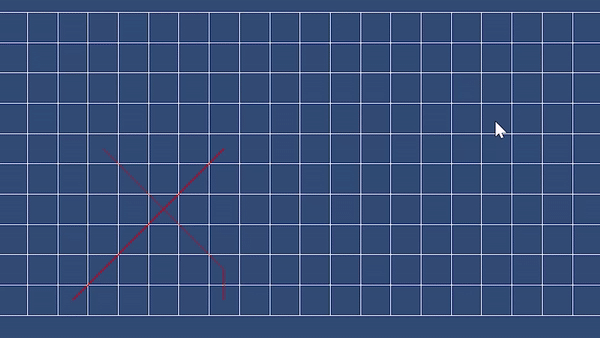

# Multi agent pathfinding

Having multiple agents find their path to their goal while not colliding with eachother.

## Demo

Pathfinding of 2 agents without collision

Pathfinding of 2 agents with collision and path recalulation

## How does it work

#### A* pathfinding

At first every agent calculates it's individual path 

#### Collision checks

After every agent has calculated its path then it checks each agents path with the other paths for collisions. (collisions only happen if they are at a point at the same time of course)

#### Recalculate path

When a collision occurs recalculate the path for an agent that collided while avoiding the collision point. Then check for collisions again and repeat this until no collisions are present.

## Implementation

This demo was implemented using Unity with C#.

#### Internal Structure

The agent is formed by a deep neural network, with variable number of layers, neurons per layer, activation functions, loss function, optimizer, etc. By default, it was chosen a neural network with 2 hidden layers (32 neurons each); the activations `ReLu` for the inner layers and the `Linear` for the last one; `Mean Squared Error` as the loss function; `Adam` as the optimizer; `Epsilon` (exploration) starting at 1 and ending at 0, when the number of episodes reaches 75%; `Discount` at 0.95 (significance given to the future rewards, instead of the immediate ones).

#### Training

For the training, the replay queue had size 20000, with a random sample of 512 selected for training each episode, using 1 epoch.

#### Requirements

- Unity

## Results

The agents correctly recalculate paths but sometimes it keeps colliding which makes it keep calculating paths forever.

## Useful Links

#### Multi-Agent Pathfinding
Multi agent pathfinding:
https://ai.vub.ac.be/multi-agent-path-finding/?utm_source=www.google.com&utm_medium=organic&utm_campaign=Google&referrer-analytics=1
Conflict-based search for optimal multi-agent pathfinding: https://www.sciencedirect.com/science/article/pii/S0004370214001386